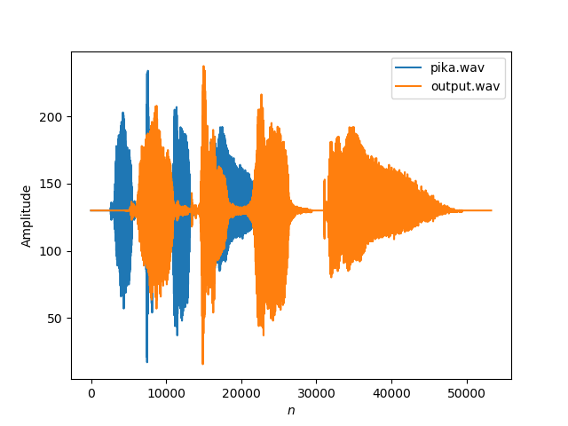

___
# Audio Processing
___

toolbox to perfom basic operations over audio signals

## Usage 
````bash
python -m controller <options> <*args>
````
- Interpolation: perfom linear interpolation over a signal by a factor and plot the resulting signals
````bash
python -m controller interpolate pika.wav 2  -p True
````


- Decimation: downsample a signal by a factor and plot the resulting signals
````bash
python -m controller decimate signal_path  factor  -p True
````

- Reflection: reflects a signal, stores the resulting signal in opath and plot the resulting signals
````bash
python -m controller reflect signal_path -o opath
````

- Shiftting: shift a signal, stores the resulting signal in opath and plot the resulting signals
````bash
python -m controller reflect signal_path -o opath
````
-help: launch the help and detailed instructions for each command
````bash
python -m controller <command> -h
````
